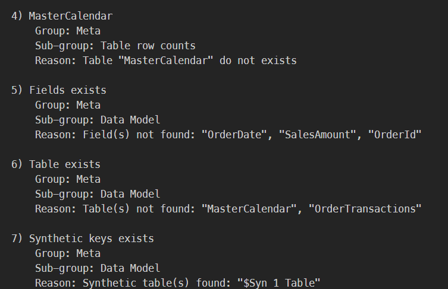

# Test-O-Matiq CLI

> **Warning**
> Under development!

---

> **Note**
> Please check out the [Wiki section](https://github.com/Informatiqal/test-o-matiq-cli/wiki) for details and examples

Command line wrapper for [test-o-matiq](https://github.com/Informatiqal/test-o-matiq)

## Introduction

This command line package wraps `test-o-matiq` package and allows running data tests against Qlik app. The tests are specified in yaml files.

## Installation

```shell
npm install -g test-o-matiq-cli
```

## Usage

Example yaml file:

```yaml
# yaml-language-server: $schema=https://github.com/Informatiqal/test-o-matiq/blob/main/src/schema/root.json?raw=true

# ^^^ used to load json schema for better intellisense

description: Set of test to execute against Qlik app
author: Someone Whatever
version: 0.0.1
selections:
  - field: Year
    values: [2020, 2021, 2022]
spec:
  Meta:
    DataModel:
      # check for fields presence
      Field: [Year, OrderDate, SalesAmount, OrderId]
      # check for table presence
      Table:
        - MasterCalendar
        - OrderTransactions
      # synthetic keys are allowed?
      SyntheticKeys: false
    Field: # number of values in fields
      - name: Year
        count: 3
      - name: OrderId
        count: 10
    Table: # number of rows in tables
      - name: OrderTransactions
        count: 10
      - name: MasterCalendar
        count: 36
    # check for variables presence
    Variable:
      Exists: [vLastYear]
      #DoNotExists: [vTest1]
  Scalar: # single expression validation. Strict comparison by default
    - name: Test expression 1
      expression: sum(Test)
      result: 0
    - name: Test expression 2
      expression: sum(1000)
      result: 1000
```

Result



